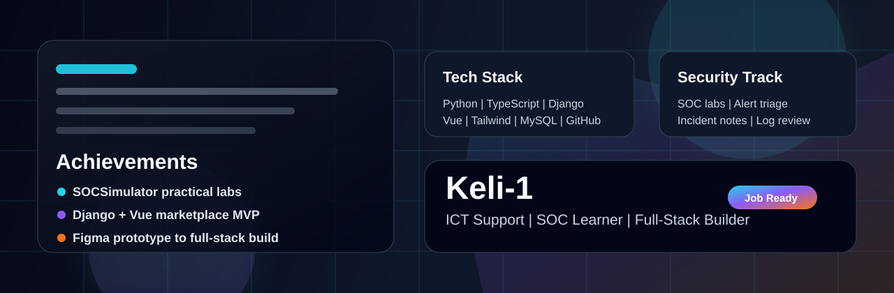

<div align="center">
  

  <h1>Ernest Kekeli Wemegah</h1>

  <p>
    <strong>ICT Support Specialist | SOC Analyst Learner | Cybersecurity Portfolio Builder | Full-Stack Developer</strong>
  </p>

  <p>
    I build secure, practical, and well-documented technology projects across ICT support, SOC analysis, GRC, UI/UX, and full-stack development.
  </p>

  <p>
    <a href="mailto:ernestwemegah@gmail.com">
      
    </a>
    <a href="https://www.linkedin.com/in/keli001/">
      
    </a>
    <a href="https://github.com/Keli-1">
      
    </a>
  </p>
</div>

---

## Professional Snapshot

ICT and cybersecurity professional focused on secure IT operations, technical support, SOC analyst practice, network security, and governance-aligned documentation.

I bring hands-on experience supporting campus ICT infrastructure, troubleshooting user and endpoint issues, configuring secure systems, and documenting technical work clearly. I started building this practical ICT foundation at the University of Health and Allied Sciences before later expanding into cybersecurity, ISO/GRC, SIEM, Linux, SQL, Python automation, Figma, and other technical skills through Coursera and Udemy coursework.

```text
Current direction:
  - ICT support and technical troubleshooting
  - SOC analyst practice, alert triage, and incident response
  - SIEM, log analysis, and detection workflows
  - GRC documentation, ISO standards, and risk thinking
  - Secure web, API, and database-backed application projects
```

## Core Focus

- ICT support and network troubleshooting
- SOC alert triage and incident response practice
- SIEM, log analysis, and detection workflows
- Linux, SQL, and Python for security tasks
- Information security governance, risk, and compliance
- Vulnerability assessment and technical documentation
- Secure web, API, and database-backed application projects

## Technical Skills

<table>
  <tr>
    <td valign="top" width="50%">
      <h3>Cybersecurity</h3>
      <p>Incident response, phishing analysis, vulnerability assessment, risk assessment, security documentation, SIEM monitoring, Splunk, Chronicle, Suricata, Wireshark, tcpdump.</p>
    </td>
    <td valign="top" width="50%">
      <h3>Governance And Standards</h3>
      <p>ISO/IEC 27001, ISO/IEC 27033, ISO 20000-1, ISO 22301, ISO 9001, GRC, ITSM, BCMS, policy documentation.</p>
    </td>
  </tr>
  <tr>
    <td valign="top" width="50%">
      <h3>Systems And Development</h3>
      <p>Linux, SQL, Python, MongoDB, Django, FastAPI, Node.js, React, Vue, TypeScript, Flutter, REST APIs, CI/CD, backups, automation, Figma.</p>
    </td>
    <td valign="top" width="50%">
      <h3>Coursework-Based Skills</h3>
      <p>Google Cybersecurity training, SOCSimulator labs, Udemy ISO/GRC courses, Figma/UI/UX coursework, Django/PWA coursework, and management-related training.</p>
    </td>
  </tr>
</table>

## Tech Stack And Engineering Arsenal

<p>
  
  
  
  
  
  
  
  
  
  
  
  
  
  
</p>

## Featured Cybersecurity Portfolio

| Project | What It Shows | Skills Demonstrated |
| --- | --- | --- |
| **SOCSimulator Threat Detection Labs** | Level 2 Palisade profile with 360 XP, 79.1% accuracy, and 7 completed operations covering impossible-travel sign-ins, phishing, steganography exfiltration, weaponized SVG files, and Trojan activity. | SOC triage, alert investigation, threat detection, SIEM/XDR awareness |
| **Incident Handler's Journal** | Documented ransomware, phishing, Wireshark, tcpdump, and Suricata-based investigation workflows using structured incident-response notes. | Incident response, evidence handling, NIST lifecycle thinking |
| **Python Access-Control Automation** | Built an algorithm that updates an allow list by removing unauthorized IP addresses from a restricted-network access file. | Python, file handling, access control, automation |
| **Vulnerability Assessment Report** | Assessed Linux/MySQL database server risks using NIST SP 800-30 concepts and recommended authentication, authorization, auditing, MFA, TLS, and IP allow-listing controls. | Risk assessment, remediation planning, database security |
| **PASTA Threat Modeling** | Modeled risks for an application using API, PKI, SHA-256, and SQL components; identified SQL injection and broken object-level authorization risks. | Threat modeling, API security, application security |
| **Network Traffic Analysis** | Used tcpdump-style DNS and ICMP evidence to identify a UDP port 53 unreachable issue and recommend DNS service and firewall checks. | Network analysis, troubleshooting, protocol interpretation |

Portfolio evidence:
https://drive.google.com/drive/folders/1uE_1WhFgbNGQsz1wLlt-tmtKnlmLoftt

## Featured Build Projects

| Project | What It Shows | Stack |
| --- | --- | --- |
| **BidVista 3D Marketplace** | A 3D e-commerce and auction MVP with cart, seller listing, admin login, Paystack test checkout, and responsive UI. | Django, Vue, TypeScript, Tailwind CSS, MySQL-ready database |
| **Figma Product Prototypes** | Design-first planning for marketplace screens, user flows, and job-ready project presentation. | Figma, UI/UX, product design |
| **ICT Support Portfolio** | Troubleshooting, system setup, endpoint support, documentation, and workplace technology assistance. | Windows, networking basics, support workflow |

## Professional Experience Snapshot

**University of Health and Allied Sciences - ICT Assistant / Technical Support**

- Supported campus network infrastructure, endpoint systems, and user-facing ICT services.
- Provided Tier 1 and Tier 2 support for faculty, staff, and students.
- Configured and updated system software images in line with data and security policies.
- Assisted with network traffic monitoring to identify vulnerabilities and unauthorized access points.
- Built this practical ICT experience before completing the later Coursera and Udemy cybersecurity/ISO coursework.

**Freelance ICT / Web Development Projects**

- Designed and deployed websites, web applications, and APIs.
- Worked with hosting, CI/CD workflows, backups, automation, and performance optimization.
- Applied UI/UX design thinking with Figma for user-facing project work.

## Certifications And Training

- Google Cybersecurity Professional Certificate - Coursera
- Mastercard Cybersecurity Virtual Experience Program - Forage
- ISO/IEC 27001 Information Security Management Master Class - Udemy
- ISO/IEC 27033 Network Security Specialist - Udemy
- ISO 20000-1:2018 IT Service Management Implementation - Udemy
- ISO 22301 Business Continuity Management System Master Class - Udemy
- ISO 9001:2026 Quality Management Systems Practitioner - Udemy
- AI Career Essentials - ALX Africa
- AI & Data Literacy - IBM SkillsBuild

## GitHub Activity

<div align="center">
  
  
</div>

<div align="center">
  
</div>

## Recruiter Quick Read

- I can support users, troubleshoot systems, document clearly, and learn fast.
- I am building practical cybersecurity skills through SOC labs and analyst-style reporting.
- I can design and implement full-stack systems from prototype to working MVP.
- I care about clean presentation because good engineering should be easy to understand.

## Current Direction

I am building toward ICT support, SOC analyst, cybersecurity analyst, GRC, and security operations roles where I can combine technical troubleshooting, structured documentation, and practical security analysis.

## Contact

- Email: ernestwemegah@gmail.com
- LinkedIn: https://www.linkedin.com/in/keli001
- GitHub: https://github.com/Keli-1
